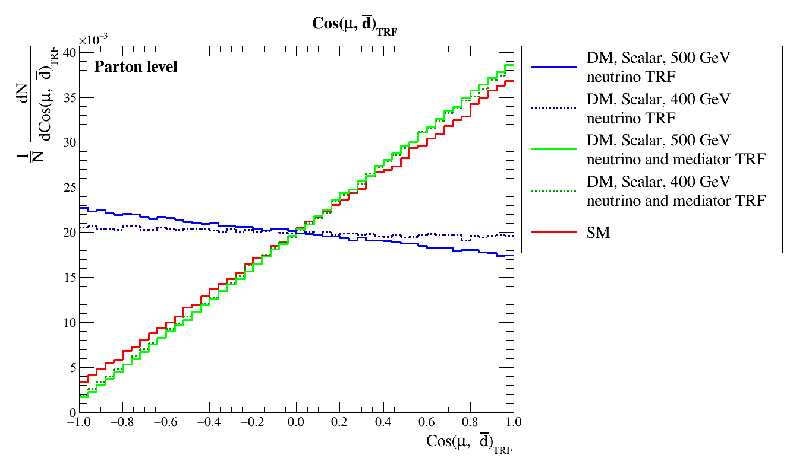

# Reconstruction of angular correlations in associated top-quark and DM mediator production
This package is designed to reconstruct the neutrino and DM mediator momenta and conserve the angular correlations of the top-quark first discussed in [Angular correlations in associated top-quark and dark matter production at Large Hadron Collider][1]. Several approaches are presented, which include BDT, MLP and Normalizing Flows neural networks. 

## Data
There are 4 different data samples in this project located in `data/`. First 2 samples: `SM.root` and `DM.root`, correspond to parton-level modelling, which was done in CompHEP4.6 for Standard Model and Simplified dark matter models respectively.
`SM_delphes.root` and `DM_delphes.root` utilize 2 additional steps: hadronization done in Pythia8 and detector response in DELPHES using the CMS detector profile.
Basic data description is shown in `notebooks/FE.ipynb`.
## Training & Inference
For the two approaches to data discussed above, separate notebooks are provided: `notebooks/SpinCorrs_regression_NF.ipynb` and `notebooks/SpinCorrs_delphes.ipynb`.
For each approach 3 different neural networks are compared: dense neural network and 2 variations of Normalizing Flows. 
- Basic flows model consists of Affine autoregressive transforms and represents one the simplest architectures. 
- $\nu$-flows model follows the [original article][2], which developed the architecture for the similar task in $t\bar{t}$ production.

All these models can be found in the `src\sc_models.py`. Note that the use of the GPU is **strongly recommended**, especially for Normalizing Flows due to their complexity. Additionally, since the inference in these models requires sampling the probability distributions, it can take a significant time and memory.
**Note**: for proper inference on GPUs, `pytorch-cuda>=12.1` is needed due to bugs in triangular solvers for older versions.

Description of main parameters of $\nu$-flows:
- `spline_conf`: coupling function, which in this case is a dense network with configurable structure
- `target_size`: dimensionality of the targets. Here it is 6: 3 components of momentum per neutrino and mediator
- `masking_order`: in the coupling layer, only part of the target features is transformed in each layer, with the partition alternating between layers. The `masking_order` variable specifies these features with 1, and others with -1 (for the first layer)
- `encoder`: preprocessing of the context (embedding function)

[1]:https://doi.org/10.1142/S0217751X24501264
[2]:https://doi.org/10.21468/SciPostPhys.14.6.159
